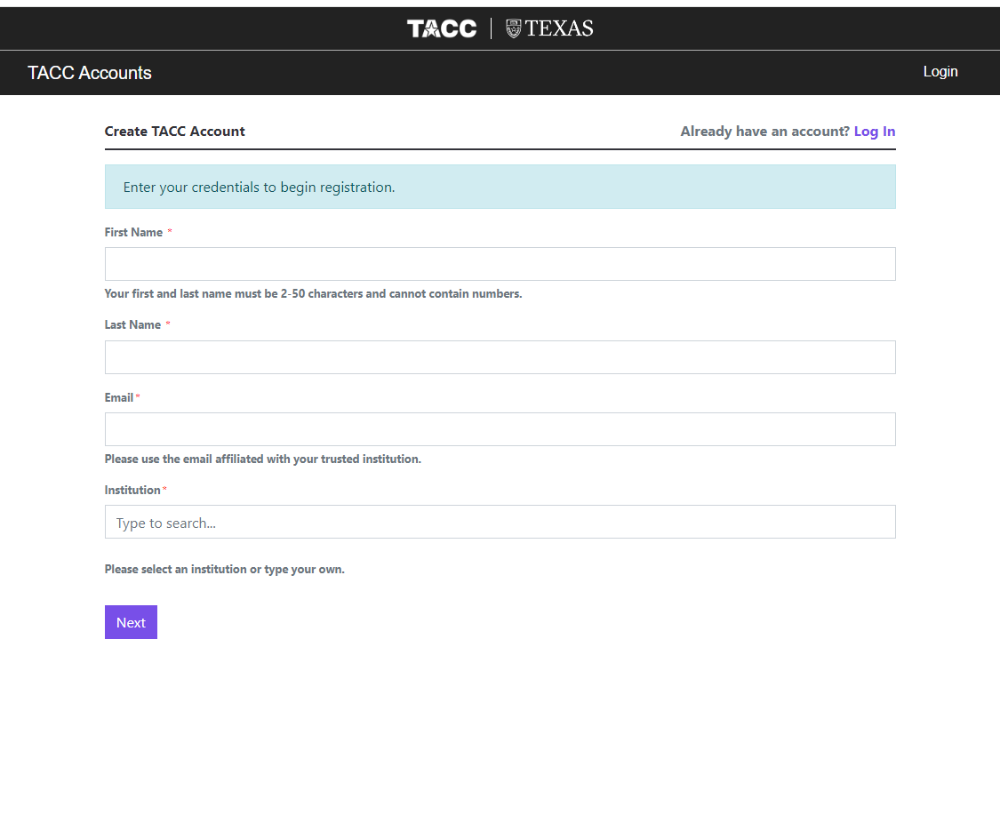
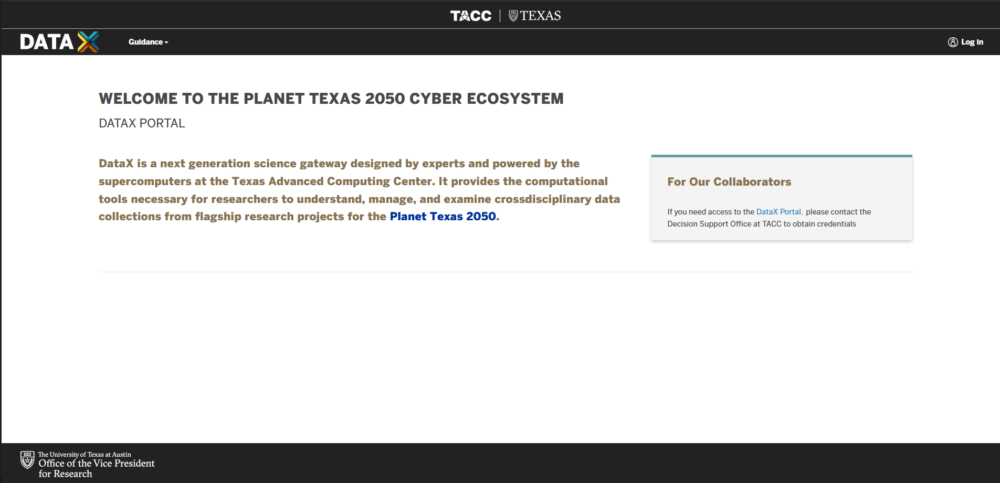
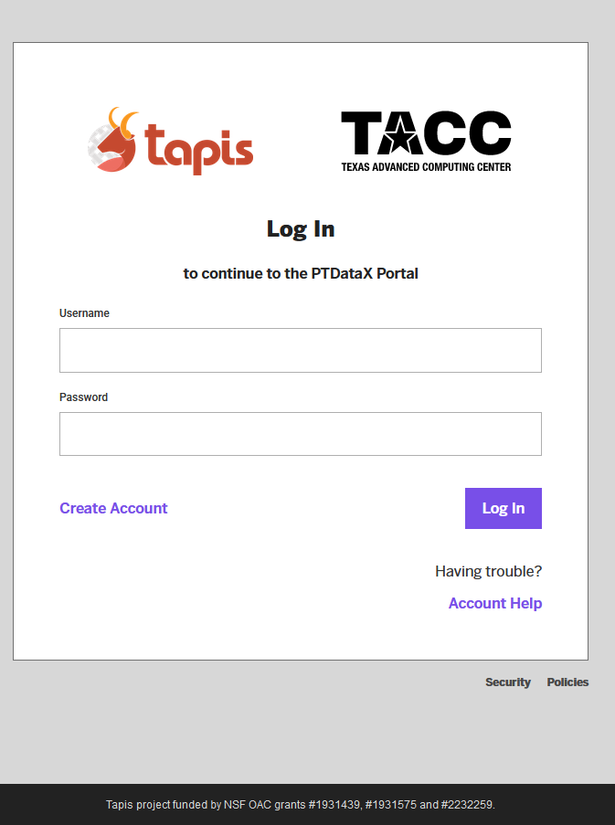
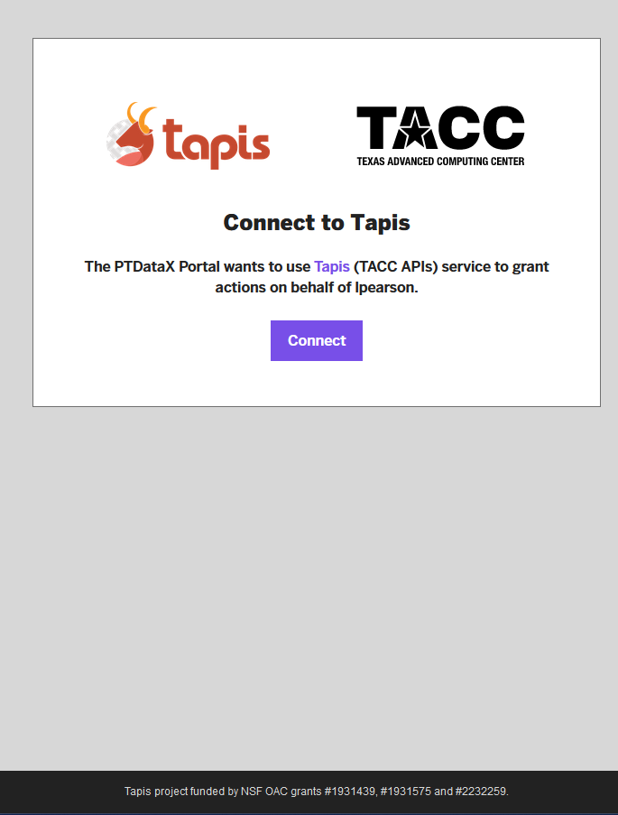
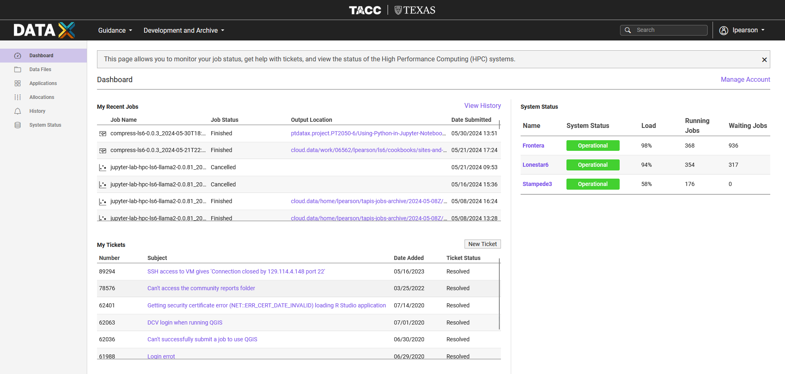
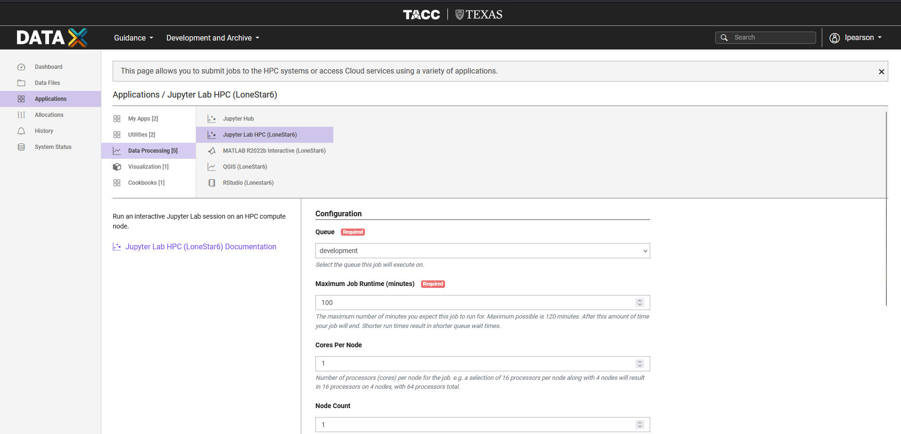
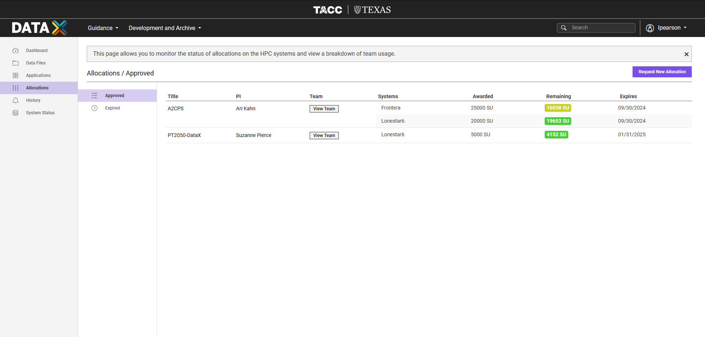
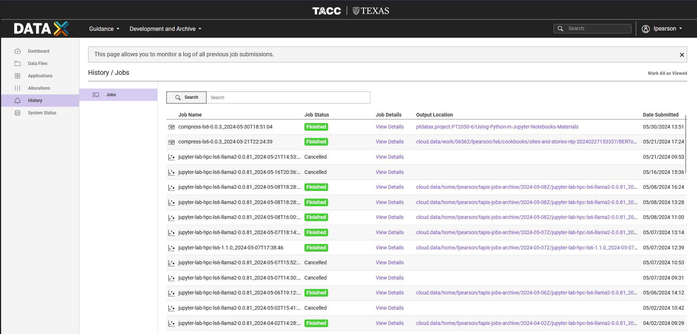
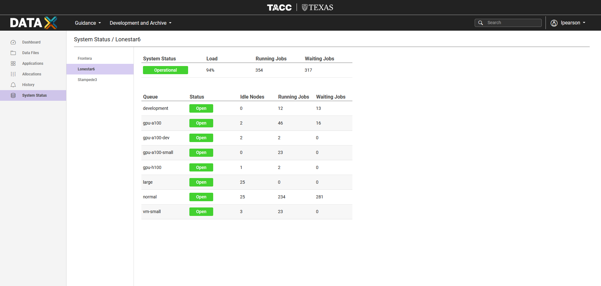

## TACC Account Creation

Register for a new TACC acount at [https://accounts.tacc.utexas.edu/register](https://accounts.tacc.utexas.edu/register)

## Login 

Login to [DataX](https://ptdatax.tacc.utexas.edu/) using your TACC account and Tapis credentials.  If succesful, click to the 'connect' button to login to DataX

  

  

## DataX Portal

### Dasbhoard

  

### Data Files

  

### Applications

  

### Allocations

  

### History

  

### System Status

  